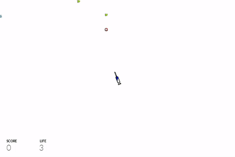

# Mitosis

Protect the body and kill the germs in **Mitosis**, simple germ shooter game which is also a submission for **IF2210 Object-Oriented Programming** assignment. **Mitosis** can be played by one or two players with different keys for controlling the 2<sup>nd</sup> syringe shooter.

## Getting Started

### Preparation

**Mitosis** requires Java Runtime Environment (JRE) version 1.8 or higher which is available at [Java website here](https://www.oracle.com/technetwork/java/javase/downloads/index.html). **Mitosis** itself can be downloaded on [releases page here](https://github.com/nieltg/mitosis/releases).

### Run

**Mitosis** can be run by double-clicking at `mitosis-VERSION.jar` or using the command-line.

```
java -jar mitosis-VERSION.jar
```

The `VERSION` parts in the statements above must be adjusted to the one which has been downloaded before at previous step.

### Gameplay



Shoot all germs are passing from the top of the screen using the syringe shooter. Don't let them reach the bottom of the screen or the live points will be decreased. The game overs when the live points reaches zero.

Don't worry. There are medicine power-ups which help by increasing the live points which can be activated by shooting them.

#### Single Player Mode

Single Player Mode provides single syringe shooter which can be controlled by using these key bindings.

|    Key    |                  Action                  |
|:---------:|:----------------------------------------:|
| **Left**  | Rotate the syringe shooter to the left.  |
| **Right** | Rotate the syringe shooter to the right. |
| **Down**  | Shoot the germs or power-ups.            |

#### Two-Player Mode

Two-Player Mode provides another syringe shooter which can be controlled by using these key bindings.

| Key |                    Action                    |
|:---:|:--------------------------------------------:|
| `A` | Rotate the 2<sup>nd</sup> syringe shooter to the left.  |
| `D` | Rotate the 2<sup>nd</sup> syringe shooter to the right. |
| `S` | Shoot using the 2<sup>nd</sup> syringe shooter.         |

### Plugins

**Mitosis** is designed to be simply extendable. There are two provided plugins:

- **GamePak** adds more elements to the game.
- **MusicPak** adds music and audio effects to the game.

Plugins can be discovered and activated by putting them in a directory named `plugins`, which is located beside **Mitosis**. The directory structure will somewhat resembles the structure below.

<pre>
.  
&#x251C;&#x2500;&#x2500; mitosis-VERSION.jar  
&#x2514;&#x2500;&#x2500; plugins  
&nbsp;&nbsp;&nbsp;&nbsp;&#x251C;&#x2500;&#x2500; gamepak-VERSION.jar  
&nbsp;&nbsp;&nbsp;&nbsp;&#x2514;&#x2500;&#x2500; musicpak-VERSION.jar  
  
1 directory, 3 files
</pre>

## Hacking

### Requirements

**Mitosis** development requires Java Development Kit (JDK) version 1.8 or higher which is available at [Java website here](https://www.oracle.com/technetwork/java/javase/downloads/index.html).

### Compile

**Mitosis** uses Gradle can be compiled using either command-line or from the IDE.

```
./gradlew build
```

The build process will also tests the unit tests, check the coding style, analyze the dependencies of classes and put the reports on `build` directory. The documentation can also be generated using the command below.

```
./gradlew javadoc
```

### Run

**Mitosis** can be run via the IDE or via command-line using Gradle.

```
./gradlew run
```

## Credits

**Mitosis** is bought to you by **Sterilecode** team:

- 13515001 Jonathan Christoper ([nathanchrs](https://github.com/nathanchrs))
- 13515002 Wenny Yustalim ([wennyyustalim](https://github.com/wennyyustalim))
- 13515071 Daniel Pintara ([nieltg](https://github.com/nieltg))
- 13515093 Reinaldo Ignatius ([reinaldoignatius](https://github.com/reinaldoignatius))
